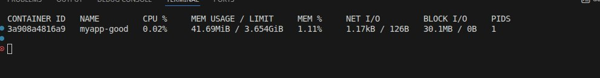
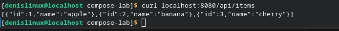
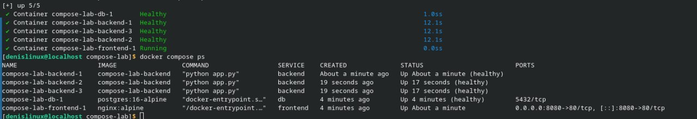

# Лабораторные работы: Docker и Docker Compose

## Пара 2 – Docker: образы, Dockerfile, запуск

**Что выполнено:**
- Написан Dockerfile для Python-приложения (Flask)
- Собран образ, запущен контейнер
- Применён multistage build (размер образа уменьшен более чем в 3 раза)
- Контейнер запущен с ограничениями CPU (0.5) и RAM (128M)
- Просмотрены слои образа (`docker history`, `docker inspect`)
- Использован `.dockerignore`
- Образ опубликован на Docker Hub

## Пара 3 – Docker: сети, volumes, docker-compose

**Что выполнено:**
- Создана bridge-сеть, проверено разрешение имён
- PostgreSQL с persistent volume (данные сохранены после перезапуска)
- Написан `docker-compose.yml` для трёх сервисов (nginx → Flask → PostgreSQL)
- Стек поднят, сервисы имеют healthcheck
- Выполнено масштабирование backend до 3 экземпляров
- Проверена работа через nginx (`curl localhost:8080/api/items`)

---

## Скриншоты выполнения

