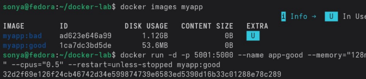
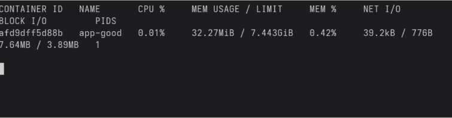
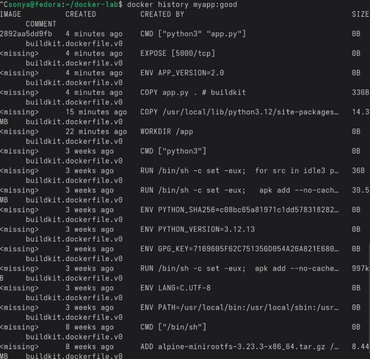

# Лабораторная работа — Docker: образы, контейнеры и публикация

## Введение

Цель лабораторной работы — познакомиться с базовыми приёмами работы с Docker: сборкой образов, запуском и оптимизацией контейнеров, ограничением ресурсов, анализом слоёв и публикацией образов в удалённом репозитории. В ходе выполнения использовалось простое Flask‑приложение, для которого последовательно создавались разные варианты Docker‑образов и проверялась их работа.

## Блок 1. Базовый образ и первый контейнер

Создана рабочая директория командой:

```bash
mkdir ~/docker-lab && cd ~/docker-lab
```

В этой папке подготовлены файлы:
- `app.py` — простое Flask‑приложение с обработчиком на порту 5000;
- `requirements.txt` — файл зависимостей с пакетом `flask`;
- `Dockerfile` — базовая инструкция по сборке образа.

В первом блоке создан простой Dockerfile на основе полной (тяжёлой) версии образа Python.  
Образ собран командой:

```bash
docker build -t myapp:bad .
```

Размер получившегося образа составил примерно **1.12 GB**.  
Контейнер запущен командой:

```bash
docker run -d -p 5000:5000 --name app-bad myapp:bad
```

Проверка работы приложения:

```bash
curl localhost:5000
```

Команда вернула приветственное сообщение из Flask‑приложения, что подтверждает корректный запуск.

## Блок 2. Оптимизация образа и лимиты ресурсов

Для уменьшения размера образа Dockerfile заменён на новый, с использованием более лёгкой базовой системы и многоступенчатой (multistage) сборки.  
Дополнительно создан файл `.dockerignore`:

```bash
nano .dockerignore
```

В `.dockerignore` добавлены лишние файлы и каталоги, чтобы они не попадали внутрь образа.

Новый оптимизированный образ собран командой:

```bash
docker build -t myapp:good .
```

Размер образа `myapp:good` составил около **53.6 MB**, то есть примерно в 20 раз меньше первоначального варианта.  
Проверка размеров выполнена командой:

```bash
docker images myapp
```



Далее контейнер с оптимизированным образом запущен с ограничениями по ресурсам:

```bash
docker run -d -p 5001:5000 --name app-good --memory="128m" --cpus="0.5" myapp:good
```

Изначально при проверке:

```bash
curl localhost:5001
```

приложение не отвечало. Просмотр логов контейнера:

```bash
docker logs app-good
```

показал ошибку запуска, связанную с использованием `python` вместо `python3` в Alpine‑окружении.

В Dockerfile скорректирована строка запуска:

```dockerfile
CMD ["python", "app.py"]
```

на

```dockerfile
CMD ["python3", "app.py"]
```

После исправления образ пересобран, старый контейнер остановлен и удалён:

```bash
docker stop app-good
docker rm app-good
docker build -t myapp:good .
```

Затем создан новый контейнер с теми же параметрами запуска. Повторная проверка:

```bash
curl localhost:5001
```

показала корректный ответ приложения.

Для контроля использования ресурсов использована команда:

```bash
docker stats app-good
```

Вывод показал, что контейнер потребляет немного памяти и CPU, укладываясь в заданные лимиты.  


Исследование структуры образа выполнено командой:

```bash
docker history myapp:good
```

Вывод показал небольшое количество слоёв и компактную сборку.  
Для сравнения команда `docker history myapp:bad` отобразила больше слоёв и большой общий размер.  


Дополнительно выполнена команда:

```bash
docker inspect myapp:good | jq '..RootFS'
```

которая показала хеши файловой системы образа.

Для более детального анализа установлена утилита `dive`.  
Команда:

```bash
docker create --name inspect-me myapp:good
docker export inspect-me | tar -tv | head -30
```

позволила посмотреть список файлов внутри контейнера.

## Блок 4. Публикация образа в Docker Hub

Для выгрузки образа в репозиторий выполнен вход:

```bash
docker login -u sofavez228
```

После ввода пароля образу назначен имя/тег для Docker Hub:

```bash
docker tag myapp:good sofavez228/flask-demo:v1.0
```

Загрузка образа в облако:

```bash
docker push sofavez228/flask-demo:v1.0
```

После проверки образ локально удалён:

```bash
docker rmi sofavez228/flask-demo:v1.0
```

Образ снова загружен из Docker Hub:

```bash
docker pull sofavez228/flask-demo:v1.0
```

Запуск контейнера из удалённого образа:

```bash
docker run -d -p 5002:5000 sofavez228/flask-demo:v1.0
```

Проверка работы сервиса:

```bash
curl localhost:5002
```

Команда вернула корректный ответ приложения.  
Страница образа в Docker Hub доступна по ссылке:  
https://hub.docker.com/r/sofavez228/flask-demo

## Заключение

В рамках лабораторной работы освоены основные операции с Docker: создание и оптимизация образов, запуск контейнеров с ограничениями по ресурсам, анализ слоёв и публикация образа в Docker Hub. Использование multistage‑сборки и файла `.dockerignore` позволило уменьшить размер образа примерно в 20 раз и исключить лишние файлы. Настройка лимитов по памяти и CPU показала, как защищается хостовая система от избыточного потребления ресурсов контейнером. Полученный опыт демонстрирует практическую ценность Docker для развёртывания и распространения приложений.
