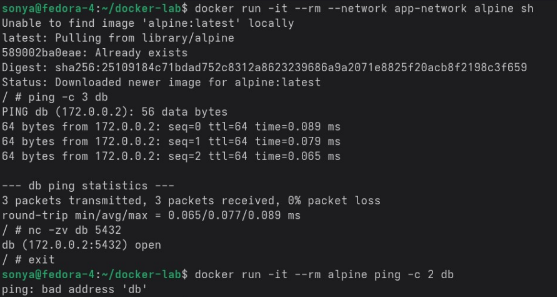
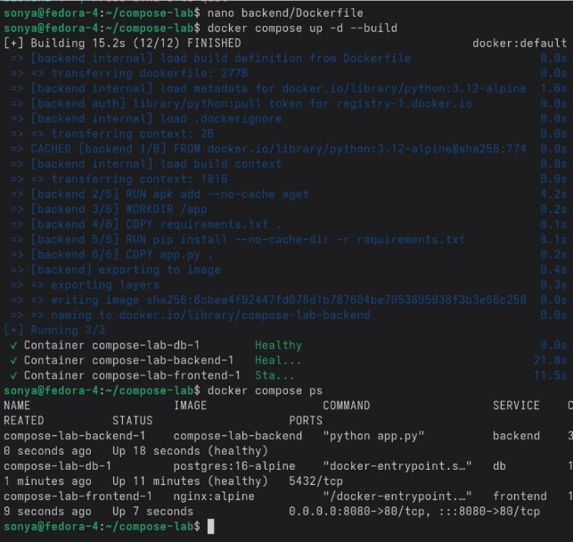
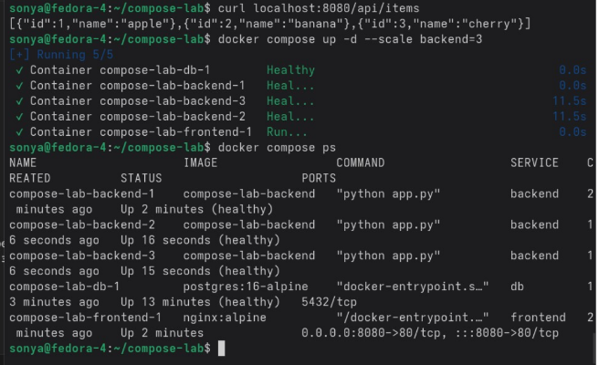

# Лабораторная работа — Docker: сети, тома и docker-compose

## Введение

Цель работы — изучить основы сетевого взаимодействия контейнеров, работу с томами данных и использование docker-compose для управления несколькими сервисами. В ходе выполнения настроены пользовательские сети, создано устойчивое хранилище для базы данных и развернут стек из нескольких контейнеров (PostgreSQL, backend и nginx‑frontend).

---

## Блок 1. Сети Docker и DNS между контейнерами

Создаётся папка для проекта, выполняется переход в неё.  
Текущий список сетей просматривается командой:

```bash
docker network ls
```

Детали стандартной сети `bridge` проверяются командой:

```bash
docker network inspect bridge
```

Создаётся отдельная изолированная сеть для приложения:

```bash
docker network create --driver bridge app-network
```

Далее запускается контейнер с базой данных PostgreSQL:

```bash
docker run -d --name db --network app-network -e POSTGRES_PASSWORD=secret postgres:16-alpine
```

Контейнер автоматически подключается к сети `app-network`.  
Для проверки связи разворачивается тестовый контейнер:

```bash
docker run -it --rm --network app-network alpine sh
```

Внутри тестового контейнера выполняется команда:

```bash
ping db
```

Имя `db` успешно разрешается в IP‑адрес, что подтверждает работоспособность встроенного DNS в сети Docker.  
Дополнительно проверяется доступность порта PostgreSQL:

```bash
nc -zv db 5432
```

Для проверки изоляции запускается контейнер без указания сети, в стандартной сети `bridge`.  
Попытка выполнить `ping db` из такого контейнера заканчивается ошибкой — имя `db` не разрешается.  
Из этого делается вывод, что пользовательские сети изолируют контейнеры друг от друга и одновременно обеспечивают им DNS‑имена внутри одной сети.

Скриншот запуска тестового контейнера и проверки связи:



---

## Блок 2. Тома Docker и сохранность данных PostgreSQL

Для хранения данных базы создаётся отдельный том:

```bash
docker volume create pgdata
```

С помощью тома запускается контейнер PostgreSQL:

```bash
docker run -d --name postgres-persistent \
  -e POSTGRES_DB=mydb \
  -e POSTGRES_USER=user \
  -e POSTGRES_PASSWORD=pass \
  -v pgdata:/var/lib/postgresql/data \
  postgres:16-alpine
```

Том `pgdata` подключён к каталогу с данными базы внутри контейнера.  
Затем создаются тестовые данные:

```bash
docker exec -it postgres-persistent \
  psql -U user -d mydb -c "CREATE TABLE items (id SERIAL, name TEXT); INSERT INTO items VALUES (1, 'test');"
```

Контейнер с базой удаляется:

```bash
docker rm -f postgres-persistent
```

Том при этом остаётся на месте.  
Запускается новый контейнер с тем же томом (например, под именем `postgres-restored`) с аналогичными параметрами.  
Проверка сохранности данных выполняется командой:

```bash
docker exec postgres-restored \
  psql -U user -d mydb -c "SELECT * FROM items;"
```

В выводе присутствует ранее добавленная запись, что подтверждает сохранение данных в томе.  
Команда:

```bash
docker volume inspect pgdata
```

показывает путь к каталогу тома на хостовой системе.

---

## Блок 3. Стек из трёх сервисов с помощью docker-compose

Создаётся структура проекта для docker-compose.  
В корне каталога размещаются следующие файлы:

- `app.py` — backend на Python с подключением к PostgreSQL и REST‑обработчиком `/api/items`;
- `requirements.txt` — список зависимостей для backend (например, `flask`, `psycopg2`);
- `Dockerfile` — инструкция по сборке образа backend;
- `nginx.conf` — конфигурация nginx для проксирования запросов на backend;
- `docker-compose.yml` — описание сервиса базы данных, backend и frontend.

В `docker-compose.yml` описываются три сервиса:

- `db` — контейнер PostgreSQL с подключённым томом и `healthcheck`;
- `backend` — контейнер, собираемый из локального `Dockerfile`, зависит от `db`;
- `frontend` — контейнер с nginx, слушающий порт 8080 и пересылающий запросы на backend.

Стек запускается командой:

```bash
docker compose up -d --build
```



После запуска состояние контейнеров проверяется командой:

```bash
docker compose ps
```

Все сервисы переходят в состояние `running` и `healthy` (для базы данных).  


Далее создаются тестовые данные в базе:

```bash
docker compose exec db \
  psql -U user -d mydb -c "INSERT INTO items (name) VALUES ('apple'), ('banana'), ('cherry');"
```

Проверка работы всей цепочки (nginx → backend → PostgreSQL) выполняется запросом:

```bash
curl localhost:8080/api/items
```

Команда возвращает данные из таблицы `items` в виде JSON‑списка.  


Для проверки масштабирования backend запускается несколько копий сервиса:

```bash
docker compose up -d --scale backend=3
```

Команда `docker compose ps` показывает три контейнера backend.  
Список томов просматривается командой:

```bash
docker volume ls
```

Стек останавливается и удаляет контейнеры и сети:

```bash
docker compose down
```

При необходимости удаления томов используется:

```bash
docker compose down -v
```

Для очистки неиспользуемых образов, контейнеров и кэша выполняется:

```bash
docker system prune -f
```

---

## Заключение

В результате работы изучены ключевые механизмы Docker на уровне сетей, томов и многоконтейнерных приложений. Пользовательские сети позволяют изолировать трафик между группами контейнеров и предоставлять им удобные DNS‑имена. Тома обеспечивают сохранность данных при удалении и пересоздании контейнеров, что особенно важно для баз данных. Docker-compose упрощает запуск связанного набора сервисов, добавляет healthcheck и масштабирование по одной команде, а также позволяет управлять ресурсами проекта через единый конфигурационный файл.