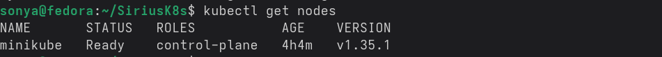
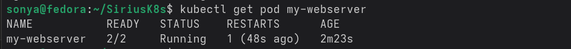
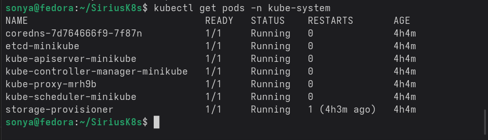
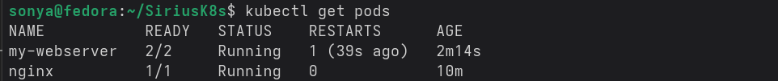

# Лабораторная работа 4 — Kubernetes: установка кластера и первые Pod’ы

## Введение

Цель работы — на практике освоить базовые операции с Kubernetes: проверку состояния кластера, запуск первых Pod’ов, создание Pod’а через YAML‑манифест и наблюдение за самовосстановлением контейнеров. В ходе выполнения изучается роль основных компонентов кластера и поведение приложений внутри Pod’ов.

---

## Блок 1. Проверка состояния кластера

Кластер подготовлен заранее (minikube или kubeadm/k3s) и находится в рабочем состоянии.  
Для начала работы выводится список нод:

```bash
kubectl get nodes -o wide
```

Команда показывает имена нод, их статус (`Ready`), версии и IP‑адреса.  


Детальная информация по конкретной ноде просматривается командой:

```bash
kubectl describe node <имя-ноды> | head -50
```

В выводе отображаются условия (Conditions), выделенные ресурсы и краткие события.

Далее просматриваются системные Pod’ы в пространстве имён `kube-system`:

```bash
kubectl get pods -n kube-system
```

Команда показывает поды компонентов Control Plane и системных сервисов (coredns, kube-proxy и др.), их статус и число рестартов.  


Состояние ключевых компонентов проверяется командой:

```bash
kubectl get componentstatuses
```

В выводе отражаются статусы etcd, scheduler и controller-manager (Healthy / Unhealthy).

Каталог статических Pod’ов Control Plane просматривается командами:

```bash
ls /etc/kubernetes/manifests/
cat /etc/kubernetes/manifests/kube-apiserver.yaml | grep -A5 "- --"
```

Таким образом видно, что основные компоненты запускаются как статические Pod’ы kubelet’ом.

---

## Блок 2. Первый Pod и исследование окружения

Первый Pod создаётся императивно командой:

```bash
kubectl run nginx --image=nginx:alpine --port=80
```

Команда создаёт Pod `nginx` с контейнером на основе образа `nginx:alpine`.  
Статус ресурсов просматривается командами:

```bash
kubectl get pods
kubectl get pods -o wide
```

Первая команда показывает список Pod’ов и их статусы, вторая — дополнительную информацию (IP, нода, используемый образ).

Наблюдение за изменением состояний выполняется командой:

```bash
kubectl get pods -w
```

Позволяет увидеть переходы `Pending → ContainerCreating → Running` в режиме реального времени.

Для входа внутрь Pod’а используется:

```bash
kubectl exec -it nginx -- sh
```

Внутри контейнера выполняются команды:

- `hostname` — показывает имя Pod’а;  
- `cat /etc/hosts` — отображает IP‑адрес Pod’а и настройки DNS;  
- `env | grep KUBE` — выводит переменные окружения, связанные с Kubernetes;  
- `ps aux` — показывает процессы внутри контейнера (собственный PID‑namespace);  
- `ip addr` — отображает сетевые интерфейсы и IP‑адрес Pod’а.

Выход осуществляется командой `exit`.

Логи контейнера просматриваются так:

```bash
kubectl logs nginx
kubectl logs nginx -f
```

Первая команда выводит накопленные логи, вторая позволяет следить за ними в режиме потока.  
Дополнительная информация о Pod’е (события, причины ошибок) получается командой:

```bash
kubectl describe pod nginx
```

---

## Блок 3. Создание Pod’а через YAML и sidecar‑контейнер

Далее создаётся файл `pod.yaml` со спецификацией Pod’а `my-webserver`.  
Манифест описывает два контейнера:

- `nginx` — основной web‑контейнер с пробами `readinessProbe` и `livenessProbe`, ограничениями по CPU и памяти;
- `log-sidecar` — вспомогательный контейнер на базе `busybox`, который пишет метки времени в файл `/var/log/access.log`.

Оба контейнера используют общий том `emptyDir` под именем `logs` для совместного доступа к логам.

Применение манифеста выполняется командой:

```bash
kubectl apply -f pod.yaml
kubectl get pods -w
```

После перехода Pod’а в статус `Running` список контейнеров внутри просматривается так:

```bash
kubectl get pod my-webserver -o jsonpath='{.spec.containers[*].name}'
```

Логи sidecar‑контейнера выводятся командой:

```bash
kubectl logs my-webserver -c log-sidecar
```

Вход в основной контейнер nginx:

```bash
kubectl exec -it my-webserver -c nginx -- sh
```

Текущая YAML‑конфигурация запуска (с учётом всех defaults) получается командой:

```bash
kubectl get pod my-webserver -o yaml | head -60
```

Состояние Pod’ов в пространстве имён `default` фиксируется командой:

```bash
kubectl get pods
```



---

## Блок 4. Самовосстановление Pod’а

Поведение Kubernetes при падении основного процесса проверяется командой:

```bash
kubectl exec my-webserver -c nginx -- kill 1
```

Убивается процесс с PID 1 внутри контейнера nginx.  
За состоянием Pod’а ведётся наблюдение:

```bash
kubectl get pods -w
```

Видно, что Pod кратковременно переходит в состояние `CrashLoopBackOff`/`Running`, после чего контейнер запускается заново.  
Счётчик рестартов отображается командой:

```bash
kubectl get pod my-webserver
```

Поле `RESTARTS` увеличивается, что подтверждает автоперезапуск контейнера kubelet’ом по заданной политике.  


---

## Краткий вывод по Pod vs Container

Pod представляет собой базовую единицу развёртывания в Kubernetes и может содержать один или несколько контейнеров, разделяющих сеть и тома. Обычный контейнер в Docker существует отдельно, а Pod управляет группой контейнеров как одной логической сущностью.

---

## Заключение

В рамках работы изучены основные действия по взаимодействию с Kubernetes‑кластером: проверка статуса нод и системных Pod’ов, создание и исследование первого Pod’а, запуск составного Pod’а с sidecar‑контейнером и наблюдение за самовосстановлением при падении процесса. На практике подтверждено, что kubelet автоматически перезапускает контейнеры в составе Pod’а согласно политике рестартов, а декларативное описание в YAML позволяет гибко задавать ресурсы, пробы и состав контейнеров. Полученные навыки закладывают базу для дальнейшей работы с Deployment, Service и более сложными объектами Kubernetes.