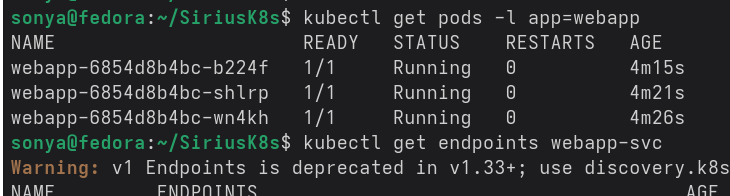
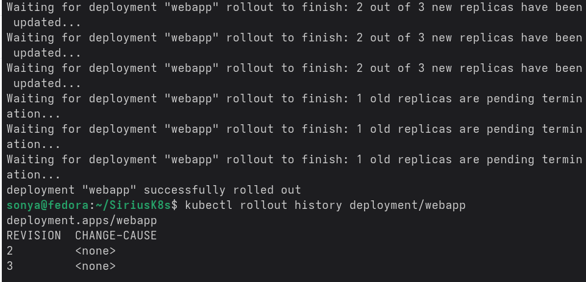

# Лабораторная работа 5 — Kubernetes: Deployment, Service, Ingress

## Введение

Цель работы — развернуть web‑приложение в Kubernetes через Deployment, настроить доступ к нему снаружи кластера с помощью Service и Ingress, а также отработать rolling update и откат версии без простоя сервиса. В ходе выполнения изучается, как Kubernetes управляет репликами Pod’ов, маршрутизирует трафик и хранит историю развёртываний.

---

## Блок 1. Deployment с тремя репликами

Для начала создаётся манифест `deployment.yaml` с объектом `Deployment`:

```yaml
apiVersion: apps/v1
kind: Deployment
metadata:
  name: webapp
  labels:
    app: webapp
spec:
  replicas: 3
  selector:
    matchLabels:
      app: webapp
  strategy:
    type: RollingUpdate
    rollingUpdate:
      maxSurge: 1
      maxUnavailable: 0
  template:
    metadata:
      labels:
        app: webapp
        version: v1
    spec:
      containers:
      - name: webapp
        image: nginxdemos/hello:plain-text
        ports:
        - containerPort: 80
        resources:
          requests: { cpu: "50m", memory: "32Mi" }
          limits:   { cpu: "100m", memory: "64Mi" }
        readinessProbe:
          httpGet: { path: /, port: 80 }
          initialDelaySeconds: 3
          periodSeconds: 3
```

Deployment создаётся командой:

```bash
kubectl apply -f deployment.yaml
```

Состояние Pod’ов проверяется так:

```bash
kubectl get pods
kubectl get pods -w
```

Команды показывают три Pod’а `webapp` в статусе `Running` и их появление в режиме просмотра с `-w`.  


Статус самого Deployment отслеживается командой:

```bash
kubectl rollout status deployment/webapp
```

Из этой команды видно, когда развёртывание завершено.  
Список ReplicaSet, которыми управляет Deployment, выводится:

```bash
kubectl get rs
```

---

## Блок 2. Service NodePort и rolling update

Для публикации Deployment наружу создаётся манифест `service.yaml`:

```yaml
apiVersion: v1
kind: Service
metadata:
  name: webapp-svc
spec:
  selector:
    app: webapp
  type: NodePort
  ports:
  - port: 80
    targetPort: 80
    nodePort: 30080
```

Service создаётся командой:

```bash
kubectl apply -f service.yaml
```

Далее определяется IP ноды:

```bash
NODE_IP=$(kubectl get nodes -o jsonpath='{.items.status.addresses.address}')
# или для minikube:
# NODE_IP=$(minikube ip)
```

В отдельном терминале запускается бесконечный цикл для проверки трафика:

```bash
while true; do curl -s $NODE_IP:30080 | grep "Server name"; sleep 0.5; done
```

Вывод поочерёдно показывает разные имена хостов, что подтверждает балансировку по Pod’ам.

Rolling update выполняется командой:

```bash
kubectl set image deployment/webapp webapp=nginxdemos/hello:latest
```

Команда меняет образ контейнера, Deployment создаёт новый ReplicaSet и по очереди обновляет Pod’ы.  
Статус обновления контролируется:

```bash
kubectl rollout status deployment/webapp
```

При этом в терминале с `curl` никаких ошибок нет, запросы продолжают успешно обрабатываться.

История развёртываний просматривается командой:

```bash
kubectl rollout history deployment/webapp
```

Вывод показывает несколько ревизий Deployment с указанием изменённых параметров.  


Откат на предыдущую версию выполняется:

```bash
kubectl rollout undo deployment/webapp
kubectl rollout status deployment/webapp
kubectl rollout history deployment/webapp
```

После отката ревизия возвращается к первоначальной версии образа.

---

## Блок 3. Ingress и маршрутизация / и /api

Для демонстрации маршрутизации создаётся дополнительный backend:

```bash
kubectl create deployment api-backend --image=hashicorp/http-echo -- /http-echo -text="Hello from API"
kubectl expose deployment api-backend --port=5678 --name=api-svc
```

Ingress‑контроллер включён (в minikube через `minikube addons enable ingress`).  
Далее создаётся манифест `ingress.yaml`:

```yaml
apiVersion: networking.k8s.io/v1
kind: Ingress
metadata:
  name: webapp-ingress
  annotations:
    nginx.ingress.kubernetes.io/rewrite-target: /
spec:
  ingressClassName: nginx
  rules:
  - host: webapp.local
    http:
      paths:
      - path: /
        pathType: Prefix
        backend:
          service:
            name: webapp-svc
            port:
              number: 80
      - path: /api
        pathType: Prefix
        backend:
          service:
            name: api-svc
            port:
              number: 5678
```

Ingress создаётся командой:

```bash
kubectl apply -f ingress.yaml
kubectl get ingress
```

Для теста в `/etc/hosts` добавляется запись:

```bash
echo "$(minikube ip) webapp.local" | sudo tee -a /etc/hosts
```

Проверка маршрутизации выполняется командами:

```bash
curl webapp.local
curl webapp.local/api
```

Первый запрос возвращает страницу из `webapp` (nginx hello), второй — ответ `"Hello from API"` от сервиса `api-svc`.  


---

## Блок 4. Сравнение типов Service

В ходе работы рассматриваются три типа Service:

- **ClusterIP** создаётся командой:

  ```bash
  kubectl expose deployment webapp --name=webapp-clusterip --type=ClusterIP --port=80
  kubectl get svc webapp-clusterip
  ```

  Такой сервис доступен только внутри кластера (поле `EXTERNAL-IP` пустое). Подключение возможно из другого Pod’а через DNS‑имя.

- **NodePort** реализован в манифесте `webapp-svc` с `type: NodePort`.  
  Сервис открывает фиксированный порт (например, `30080`) на каждой ноде, и к приложению можно обращаться по `NODE_IP:NodePort` снаружи кластера.

- **LoadBalancer** используется в облачных средах.  
  При `type: LoadBalancer` провайдер создаёт внешний балансировщик и назначает реальный внешний IP. В локальных средах (minikube без облака) такой сервис обычно остаётся в статусе `Pending`.

---

## Что было продемонстрировано

Состояние Deployment и Pod’ов фиксируется командой:

```bash
kubectl get pods
```

Команда показывает три Pod’а `webapp` в статусе `Running`.  


История развёртываний показывает наличие нескольких ревизий и успешный откат:

```bash
kubectl rollout history deployment/webapp
```

Запросы:

```bash
curl webapp.local
curl webapp.local/api
```

демонстрируют корректную маршрутизацию через Ingress к разным сервисам.

---

## Заключение

В ходе лабораторной работы создан Deployment с тремя репликами web‑приложения, настроен Service типа NodePort и выполнен rolling update без простоя, с последующим откатом на предыдущую версию. Дополнительно настроен Ingress, который разделяет трафик по путям `/` и `/api` между фронтендом и backend‑сервисом. На практике рассмотрена разница между типами Service: ClusterIP используется для внутреннего доступа в кластере, NodePort открывает фиксированный порт на нодах для внешних запросов, а LoadBalancer предназначен для интеграции с облачными балансировщиками.