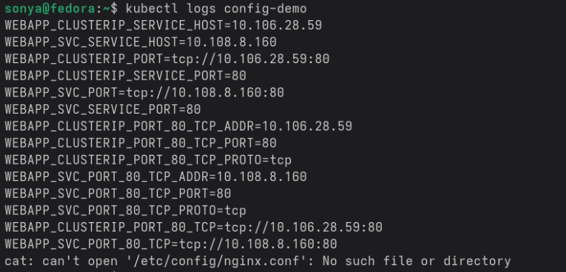
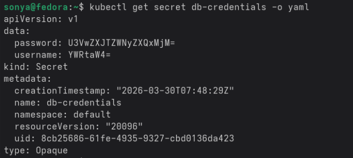
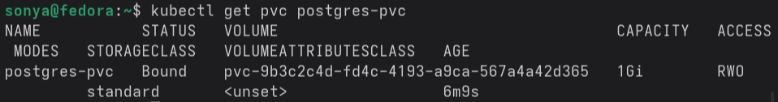

# Лабораторная работа 6 — Kubernetes: ConfigMap, Secret, PersistentVolume

## Введение

Цель работы — отделить конфигурацию и данные от кода приложения с помощью ресурсов ConfigMap, Secret и PersistentVolume. В процессе выполнения отрабатывается передача настроек в Pod через переменные окружения и файлы, создание секретов, а также подключение постоянного хранилища для базы данных PostgreSQL.

---

## Блок 1. ConfigMap и передача конфигурации в Pod

Сначала создаётся ConfigMap из литералов:

```bash
kubectl create configmap app-config \
  --from-literal=APP_ENV=production \
  --from-literal=LOG_LEVEL=info \
  --from-literal=MAX_CONNECTIONS=100
```

Команда сохраняет три ключа конфигурации, которые могут быть использованы в Pod’ах.  
Проверка содержимого выполняется:

```bash
kubectl get configmap app-config -o yaml
kubectl describe configmap app-config
```

Далее создаётся конфигурационный файл nginx:

```bash
cat > nginx.conf << 'EOF'
server {
    listen 80;
    server_name localhost;
    location /health { return 200 "OK"; }
}
EOF

kubectl create configmap nginx-conf --from-file=nginx.conf
```

Созданный ConfigMap `nginx-conf` хранит файл `nginx.conf` целиком.

Для проверки работы используется манифест `pod-with-config.yaml`, который создаёт Pod `config-demo`. В этом Pod’е применяются три способа использования ConfigMap:

- `envFrom` — все ключи `app-config` загружаются как переменные окружения;
- `env` с `configMapKeyRef` — ключ `APP_ENV` попадает в переменную `MY_ENV`;
- `volumeMounts` + `configMap` — ConfigMap `nginx-conf` монтируется как файл в каталог `/etc/config`.

Манифест применяется командой:

```bash
kubectl apply -f pod-with-config.yaml
kubectl logs config-demo
```

В логах выводятся переменные окружения `APP_ENV`, `LOG_LEVEL`, `MAX_CONNECTIONS`, значение `MY_ENV`, а также содержимое файла `nginx.conf` из смонтированного тома.  


---

## Блок 2. Secret и передача чувствительных данных

Для хранения учётных данных создаётся Secret:

```bash
kubectl create secret generic db-credentials \
  --from-literal=username=admin \
  --from-literal=password=SuperSecret123
```

Проверка содержимого выполняется в формате YAML:

```bash
kubectl get secret db-credentials -o yaml
```

В выводе видно, что значения полей `username` и `password` закодированы в base64. Это только кодирование, а не шифрование. Для демонстрации выполняется декодирование:

```bash
echo "U3VwZXJTZWNyZXQxMjM=" | base64 -d
```

Таким образом показывается, что данные Secret легко восстанавливаются без дополнительных ключей.

Для использования секрета создаётся Pod `secret-demo` по манифесту `pod-with-secret.yaml`. В контейнере указываются переменные окружения:

```yaml
env:
- name: DB_USER
  valueFrom:
    secretKeyRef:
      name: db-credentials
      key: username
- name: DB_PASS
  valueFrom:
    secretKeyRef:
      name: db-credentials
      key: password
```

Pod создаётся и проверяется командами:

```bash
kubectl apply -f pod-with-secret.yaml
kubectl logs secret-demo
```

В логах видны строки с именем пользователя и паролем, полученными из Secret.  


В ходе обсуждения делается вывод, что Secret в Kubernetes по умолчанию не обеспечивает реальное шифрование. Для защиты требуется EncryptionConfiguration на уровне etcd либо внешний секрет‑хранилище (Vault, AWS Secrets Manager и т.п.), а также ограничение доступа к API и логам.

---

## Блок 3. PersistentVolumeClaim и PostgreSQL с постоянными данными

Для организации постоянного хранилища создаётся комбинированный манифест `postgres-pvc.yaml`:

1. **PersistentVolumeClaim `postgres-pvc`** — запрашивает 1Gi хранилища с классом `standard` (в minikube) или `local-path` (в k3s):

   ```yaml
   kind: PersistentVolumeClaim
   ...
   storageClassName: standard
   resources:
     requests:
       storage: 1Gi
   ```

2. **Secret `postgres-secret`** — содержит параметры базы данных (`POSTGRES_DB`, `POSTGRES_USER`, `POSTGRES_PASSWORD`).

3. **Deployment `postgres`** — создаёт Pod с контейнером `postgres:16-alpine`, который берёт настройки из Secret через `envFrom` и монтирует PVC в каталог `/var/lib/postgresql/data`.

4. **Service `postgres-svc`** — открывает порт 5432 внутри кластера.

Манифест применяется:

```bash
kubectl apply -f postgres-pvc.yaml
```

Статус хранилища проверяется командами:

```bash
kubectl get pvc
kubectl get pv
```

PVC `postgres-pvc` должен находиться в статусе `Bound`, а соответствующий PV создан и привязан.  


Далее в базе создаётся тестовая таблица и запись:

```bash
kubectl exec -it $(kubectl get pod -l app=postgres -o name) -- \
  psql -U pguser -d mydb -c \
  "CREATE TABLE sessions (id SERIAL, data TEXT); \
   INSERT INTO sessions (data) VALUES ('важные данные');"
```

Для проверки устойчивости данных Pod удаляется:

```bash
kubectl delete pod $(kubectl get pod -l app=postgres -o name | cut -d/ -f2)
kubectl get pods -w
```

Deployment автоматически запускает новый Pod, при этом PVC остаётся подключён к тому же каталогу.  
После перехода Pod’а в `Running` выполняется проверка таблицы:

```bash
kubectl exec -it $(kubectl get pod -l app=postgres -o name) -- \
  psql -U pguser -d mydb -c "SELECT * FROM sessions;"
```

В результате запрос возвращает ранее вставленную строку, что доказывает сохранение данных на PersistentVolume после пересоздания Pod’а.

---

## Заключение

В ходе лабораторной работы продемонстрированы три важных механизма Kubernetes для построения 12‑factor приложений. ConfigMap позволяет вынести обычную конфигурацию из образа и гибко передавать её в Pod через переменные окружения и файлы. Secret хранит чувствительные параметры отдельно, однако без дополнительного шифрования остаётся только base64‑кодированием, поэтому требует защиты доступа и использования EncryptionConfiguration или внешних хранилищ. PersistentVolume и PVC обеспечивают сохранность данных при удалении и перезапуске Pod’ов, что особенно важно для баз данных и других Stateful‑сервисов.