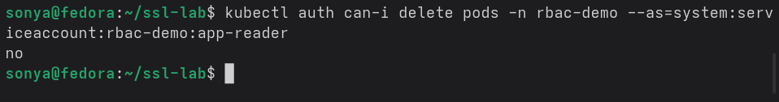
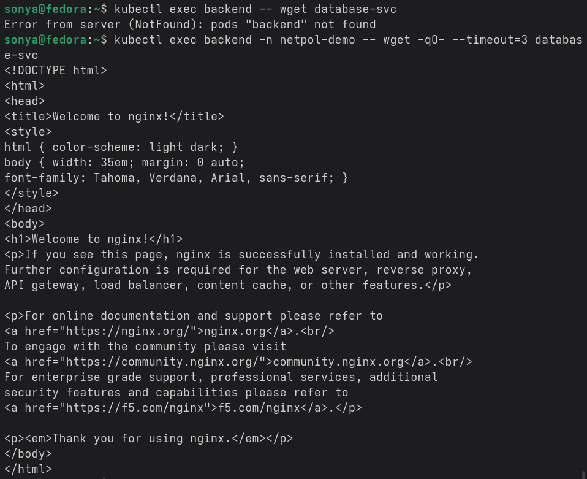
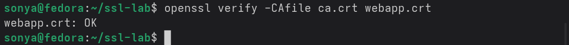

# Лабораторная работа 7 — Безопасность Kubernetes: RBAC, NetworkPolicy, TLS

## Введение

Цель работы — применить принцип минимальных привилегий в Kubernetes: настроить ограниченные права через RBAC, изолировать сетевой трафик между Pod’ами с помощью NetworkPolicy и подключить TLS‑сертификат для безопасного доступа к приложению. В процессе выполнения проверяются реальные ограничения с помощью `kubectl auth can-i` и сетевые запреты между сервисами.

---

## Блок 1. RBAC — ограниченные права ServiceAccount

Для изоляции прав создаётся отдельный namespace:

```bash
kubectl create namespace rbac-demo
```

Далее по манифесту `rbac.yaml` создаются три объекта:

- `ServiceAccount app-reader` в namespace `rbac-demo`;
- `Role pod-reader` с правами только на чтение Pod’ов и логов (`get`, `list`, `watch`) в этом namespace;
- `RoleBinding app-reader-binding`, привязывающий ServiceAccount к Role.

Манифест применяется командой:

```bash
kubectl apply -f rbac.yaml
```

Права ServiceAccount проверяются через имитацию запроса от его имени:

```bash
kubectl auth can-i list pods \
  --namespace rbac-demo \
  --as=system:serviceaccount:rbac-demo:app-reader
```

Ответ `yes` подтверждает, что в `rbac-demo` разрешено чтение Pod’ов.  


Аналогичная проверка удаление Pod’ов:

```bash
kubectl auth can-i delete pods \
  --namespace rbac-demo \
  --as=system:serviceaccount:rbac-demo:app-reader
```

даёт ответ `no`, что показывает отсутствие прав на удаление.  
Проверка доступа к namespace `default`:

```bash
kubectl auth can-i list pods \
  --namespace default \
  --as=system:serviceaccount:rbac-demo:app-reader
```

также возвращает `no`, поскольку роль ограничена namespace `rbac-demo`.

Для практической проверки запускается Pod от имени ServiceAccount:

```yaml
apiVersion: v1
kind: Pod
metadata:
  name: rbac-test
  namespace: rbac-demo
spec:
  serviceAccountName: app-reader
  containers:
  - name: kubectl
    image: bitnami/kubectl:latest
    command: ["/bin/sh", "-c", "sleep 3600"]
```

Pod создаётся и используется так:

```bash
kubectl apply -f pod-rbac-demo.yaml
kubectl exec -it rbac-test -n rbac-demo -- sh
```

Внутри контейнера:

- `kubectl get pods -n rbac-demo` успешно работает;
- `kubectl delete pod rbac-test -n rbac-demo` возвращает Forbidden;
- `kubectl get pods -n default` также Forbidden.

Это подтверждает корректную настройку RBAC по принципу минимальных привилегий.

---

## Блок 2. NetworkPolicy — изоляция трафика между Pod’ами

Для демонстрации сетевой изоляции создаётся namespace:

```bash
kubectl create namespace netpol-demo
```

В нём запускаются три Pod’а и соответствующие сервисы:

```bash
# frontend
kubectl run frontend -n netpol-demo --image=nginx:alpine --labels=role=frontend
kubectl expose pod frontend -n netpol-demo --port=80 --name=frontend-svc

# backend
kubectl run backend -n netpol-demo --image=nginx:alpine --labels=role=backend
kubectl expose pod backend -n netpol-demo --port=80 --name=backend-svc

# database
kubectl run database -n netpol-demo --image=nginx:alpine --labels=role=database
kubectl expose pod database -n netpol-demo --port=80 --name=database-svc
```

До применения политик все Pod’ы могут свободно общаться:

```bash
kubectl exec frontend -n netpol-demo -- wget -qO- backend-svc
kubectl exec frontend -n netpol-demo -- wget -qO- database-svc
```

Затем применяется набор политик `networkpolicies.yaml`:

1. `default-deny-ingress` — запрещает весь входящий трафик ко всем Pod’ам;
2. `allow-frontend-ingress` — разрешает входящий трафик к Pod’ам `role=frontend`;
3. `allow-backend-from-frontend` — разрешает доступ к `role=backend` только от Pod’ов с `role=frontend`;
4. `allow-database-from-backend` — разрешает доступ к `role=database` только от `role=backend`.

Применение:

```bash
kubectl apply -f networkpolicies.yaml
```

Проверка изоляции:

```bash
kubectl exec frontend -n netpol-demo -- wget -qO- --timeout=3 backend-svc
# запрос проходит (frontend → backend разрешён)

kubectl exec frontend -n netpol-demo -- wget -qO- --timeout=3 database-svc
# таймаут (frontend → database запрещён)

kubectl exec backend -n netpol-demo -- wget -qO- --timeout=3 database-svc
# запрос проходит (backend → database разрешён)
```

Таким образом реализуется цепочка: внешний трафик → frontend → backend → database, а прямой доступ frontend → database блокируется.  


---

## Блок 3. TLS‑сертификаты и Secret с ключами

Для защиты трафика создаётся собственный корневой сертификат (CA) и сертификат для `webapp.local` через OpenSSL. На стороне Linux выполняются команды:

```bash
mkdir -p ~/ssl-lab && cd ~/ssl-lab

# Ключ CA и самоподписанный сертификат
openssl genrsa -out ca.key 4096
openssl req -x509 -new -nodes \
  -key ca.key -sha256 -days 3650 -out ca.crt \
  -subj "/C=RU/ST=Moscow/O=SiriusLab CA/CN=SiriusLab Root CA"
```

Далее генерируется ключ и CSR для `webapp.local`, создаётся файл `webapp.ext` с SAN, и сертификат сервера подписывается CA:

```bash
openssl genrsa -out webapp.key 2048
openssl req -new -key webapp.key -out webapp.csr \
  -subj "/C=RU/O=SiriusLab/CN=webapp.local"

openssl x509 -req -in webapp.csr \
  -CA ca.crt -CAkey ca.key -CAcreateserial \
  -out webapp.crt -days 365 -sha256 -extfile webapp.ext
```

Проверка цепочки доверия:

```bash
openssl verify -CAfile ca.crt webapp.crt
# webapp.crt: OK
```



Далее сертификат и ключ загружаются в Kubernetes как TLS‑Secret:

```bash
kubectl create secret tls webapp-tls \
  --cert=webapp.crt \
  --key=webapp.key \
  -n netpol-demo
```

Ingress с HTTPS настраивается манифестом `ingress-tls.yaml`, где в секции `tls` указан `secretName: webapp-tls` и хост `webapp.local`. После применения:

```bash
kubectl apply -f ingress-tls.yaml
echo "$(minikube ip) webapp.local" | sudo tee -a /etc/hosts
```

проверка выполняется командой:

```bash
curl --cacert ca.crt https://webapp.local
```

Ответ nginx подтверждает успешное HTTPS‑соединение с использованием собственного CA. Детальная информация по сертификату может быть просмотрена через:

```bash
openssl s_client -connect webapp.local:443 -CAfile ca.crt -showcerts
```

---

## Краткие выводы по безопасности

- RBAC позволяет ограничить доступ по namespace и операциям (verbs), выдавая сервисным аккаунтам только минимально необходимые права (`get`, `list`, `watch` вместо `delete` и `update`).
- NetworkPolicy управляет сетевыми потоками между Pod’ами и даёт возможность чётко задавать, кто с кем может общаться внутри кластера.
- TLS‑сертификаты и Ingress позволяют шифровать трафик и контролировать доверие с помощью собственного CA, причём ключи и сертификаты удобно хранить в Secret.

---

## Заключение

В результате лабораторной работы настроен сервисный аккаунт с ограниченными правами, подтверждена невозможность выполнения запрещённых операций через `kubectl auth can-i` и доступ из Pod’а. Для изоляции трафика применены NetworkPolicy, которые запрещают лишние соединения и оставляют только необходимую цепочку взаимодействия между сервисами. Дополнительно создан и подключён собственный TLS‑сертификат, что обеспечивает защищённое соединение к приложению через Ingress. Эти шаги демонстрируют практическое применение принципа минимальных привилегий и базовые подходы к защите Kubernetes‑кластера.