# Отчёт по лабораторной работе — Module 3

## Память, IOPS, inode и работа с tmux. Освобождение корневого раздела

### Цель работы

1. Научиться работать с **tmux** — создавать панели, переключаться между ними, включать синхронизацию.
2. Научиться мониторить систему в реальном времени (`free`, `vmstat`, `iostat`, `df -h`).
3. Освоить диагностику и исправление переполненного диска: поиск больших файлов, удаление «открытых, но удалённых» файлов через `lsof`, уменьшение резерва файловой системы.

---

## Краткое описание

Работа состоит из двух частей. В первой части я практиковалась с tmux: открыла 4 панели, в каждой запустила утилиты мониторинга, а затем запустила `stress`, чтобы увидеть, как меняются показатели системы под нагрузкой. Во второй части я запустила скрипт‑поломку, который заполнил корневой раздел большим файлом и создал фоновый процесс, держащий удалённый файл, а моя задача была найти и устранить проблему без перезагрузки сервера.

---

## Часть A — Практика с tmux и мониторинг

### Установка необходимых пакетов

Перед началом я установила необходимые утилиты: tmux, stress и sysstat.

```bash
sudo dnf update
sudo dnf install tmux stress sysstat -y
```

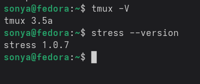

---

### Запись сессии через asciinema

Чтобы можно было показать выполнение лабораторной работы, я сразу начала запись терминала через asciinema.

```bash
asciinema rec --idle-time-limit 1 module3_tmux.cast
```

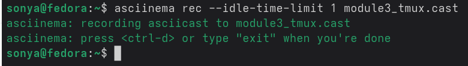

---

### Создание 4 панелей в tmux

Я запустила новую сессию tmux:

```bash
tmux new -s monitor
```

Затем разделила окно на 4 панели:

- `Ctrl+b "` — разделила окно горизонтально.
- `Ctrl+b %` — разделила верхнюю панель вертикально.
- `Ctrl+b ↓`, затем `Ctrl+b %` — разделила нижнюю панель вертикально.

В итоге у меня получилось 4 пустые панели, готовые для запуска команд мониторинга.

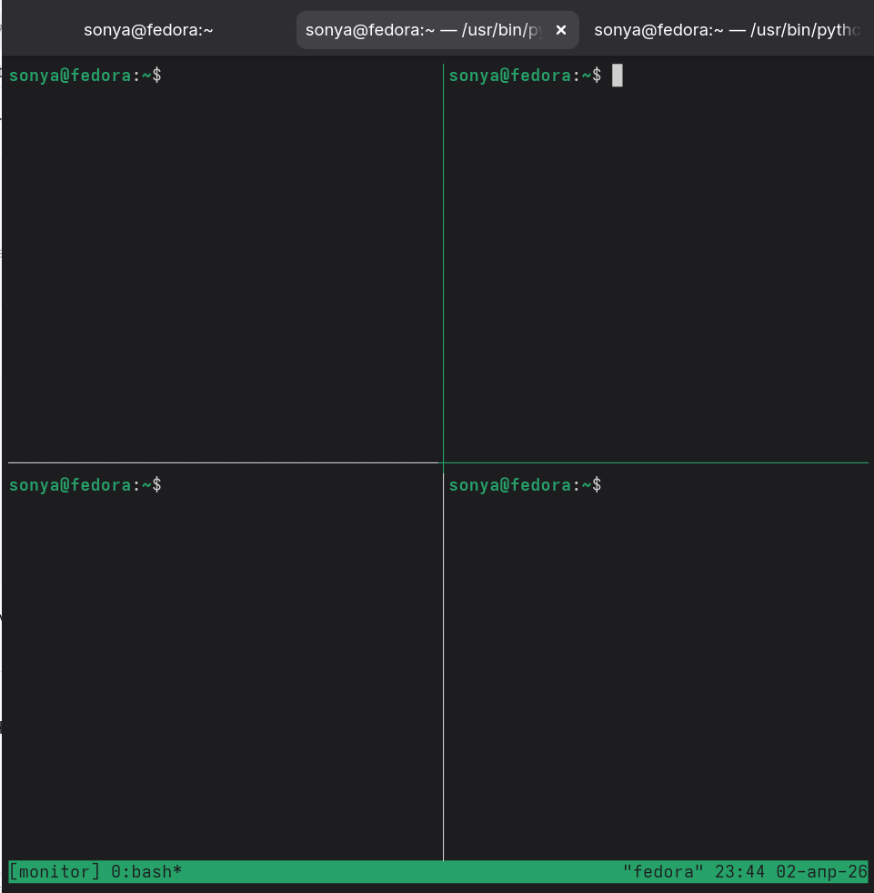

---

### Запуск мониторинга в четырёх панелях

В каждой панели я запустила свою утилиту:

| Панель                | Команда          | Что показывает                                      |
|-----------------------|------------------|-----------------------------------------------------|
| 1 (верхняя левая)     | `free -h -s 1`      | Память (RAM и swap), обновление каждую секунду      |
| 2 (верхняя правая)    | `vmstat 1`       | Процессы, память, swap, IO                          |
| 3 (нижняя левая)      | `iostat -x 1`    | Нагрузка на диски (await, util и другие метрики)    |
| 4 (нижняя правая)     | `watch df -h`    | Свободное место на файловых системах                |

После запуска команд все 4 панели начали обновляться в реальном времени.

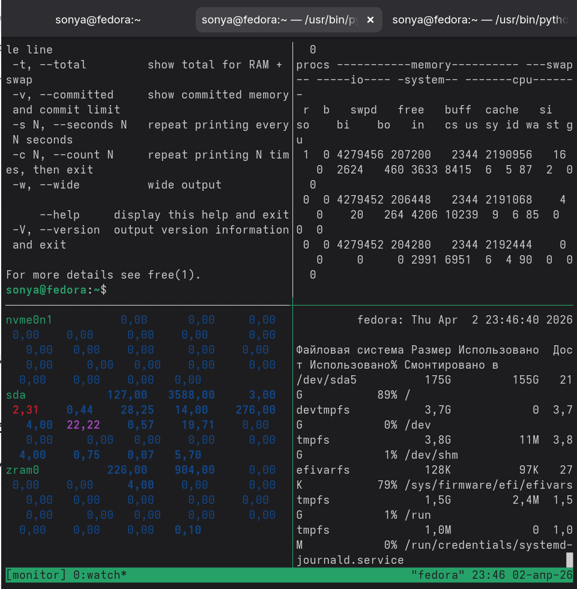

---

### Запуск стресс‑теста

Я создала новое окно в tmux (`Ctrl+b c`) и запустила нагрузку на систему:

```bash
stress --cpu 2 --vm 1 --vm-bytes 256M --timeout 30s
```

Затем вернулась в окно с мониторингом (`Ctrl+b 0`) и наблюдала изменения показателей:

- В `free -h -s` уменьшилось количество свободной памяти примерно на 256 МБ.
- В `vmstat` колонка `us` (user time) выросла до 50–80%.
- В `iostat` появилась дополнительная активность по CPU и диску.

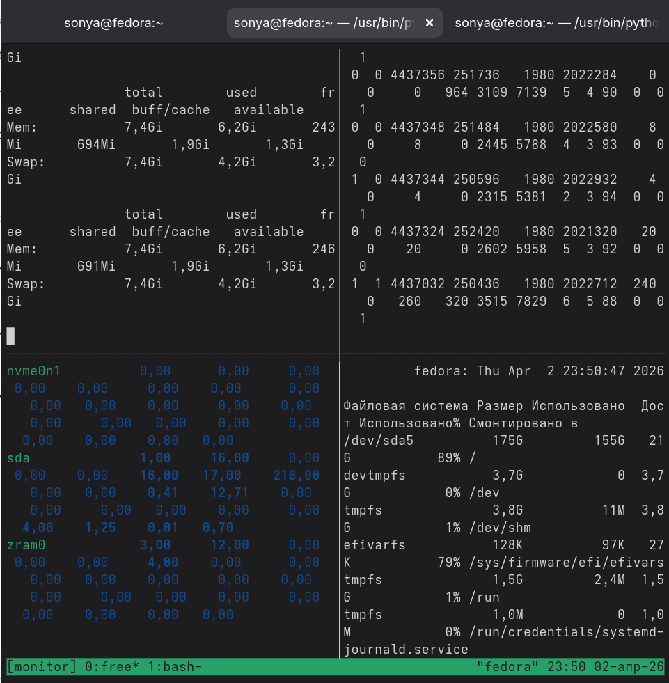

---

### Синхронизация панелей tmux

Чтобы протестировать синхронный ввод, я включила режим синхронизации панелей:

```text
Ctrl+b :setw synchronize-panes on
```

После включения я ввела команду `echo "test"` — она одновременно выполнилась во всех четырёх панелях. Затем я выключила синхронизацию командой:

```text
Ctrl+b :setw synchronize-panes off
```

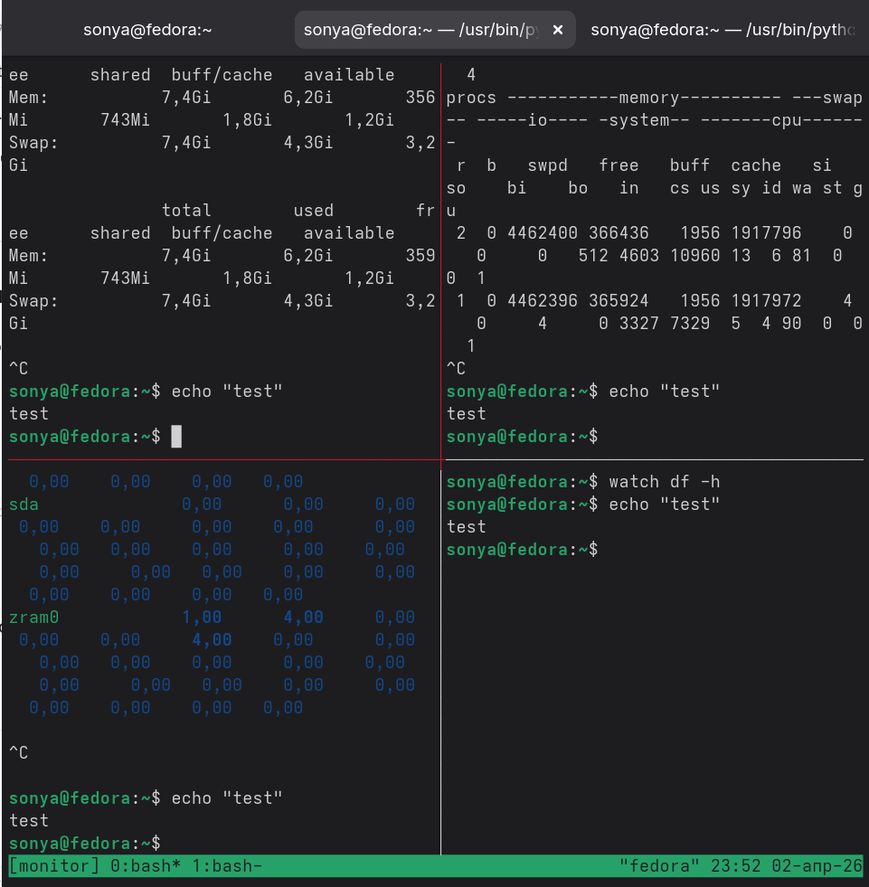

---

### Завершение работы с tmux и загрузка записи

Когда задания с мониторингом были выполнены, я:

```bash
Ctrl+b d          # отцепилась (detach) от сессии tmux
exit              # остановила запись asciinema
asciinema upload module3_tmux.cast
```

После загрузки asciinema показал ссылку на запись.

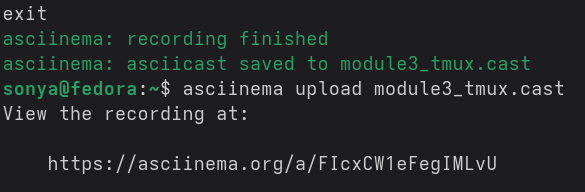

**Ссылка на запись сессии tmux:** https://asciinema.org/a/FIcxCW1eFegIMLvU

---

## Часть Б — Освобождение корневого раздела (Практическое задание №3)

### Запуск скрипта‑поломки

Согласно лабораторному заданию я перешла в нужную директорию и запустила скрипт, который создаёт проблему с заполнением диска:

```bash
cd PRACTIC/BREAK/break_lab
sudo bash 03_disk_break.sh
```

Скрипт создал большой файл и запустил фоновый процесс, держащий этот файл открытым, после чего вывел на экран путь и PID процесса.

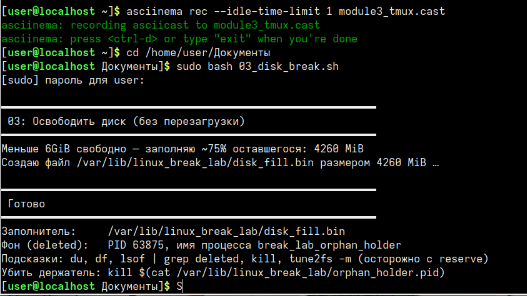

---

### Первичная диагностика заполнения диска

Сначала я проверила заполненность корневого раздела:

```bash
df -h /
```

Из вывода было видно, что корневой раздел почти полностью забит (около 95–100%).

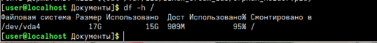

Чтобы найти крупные файлы, я посмотрела размеры в рабочей директории скрипта:

```bash
sudo du -sh /var/lib/linux_break_lab/*
```

Там нашёлся большой файл `disk_fill.bin` размером примерно 4 ГБ.

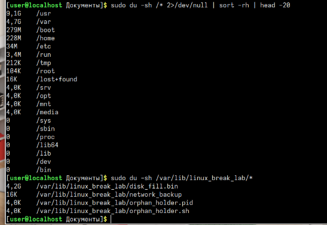

---

### Удаление большого файла

Я удалила найденный файл и сразу проверила место:

```bash
sudo rm -f /var/lib/linux_break_lab/disk_fill.bin
df -h /
```

Свободное место увеличилось, но не на всю ожидаемую величину — это означало, что файл всё ещё открыт каким‑то процессом и его место не до конца освобождено.

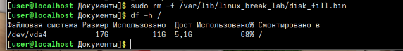

---

### Поиск «удалённого, но открытого» файла

Для поиска процессов, держащих удалённые файлы, я использовала:

```bash
sudo lsof | grep deleted
```

В выводе был виден процесс `break_lab_orphan_holder`, который держал удалённый файл `disk_fill.bin`.

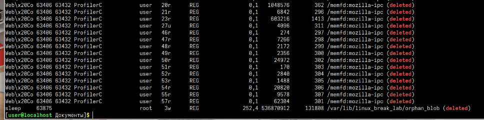

---

### Завершение процесса‑держателя

Я завершила этот процесс по PID из специального файла:

```bash
sudo kill $(cat /var/lib/linux_break_lab/orphan_holder.pid)
# альтернативный способ:
# sudo pkill -f break_lab_orphan_holder
```

После этого убедилась, что процесс больше не работает:

```bash
ps aux | grep break_lab_orphan_holder
```

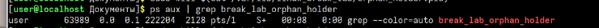

---

### Контроль свободного места

После завершения процесса я снова проверила корневой раздел:

```bash
df -h /
```

Теперь свободное место увеличилось на полные 6 ГБ — диск вернулся к нормальному состоянию, и корневой раздел больше не переполнен.

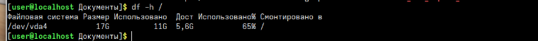

---

### (Опционально) Уменьшение резерва файловой системы

Дополнительно я проверила и при необходимости уменьшила процент зарезервированного места для root на файловой системе:

```bash
sudo tune2fs -m 1 /dev/vda4
df -h /
```

Так я освободила немного дополнительного пространства, оставив только 1% под резерв.

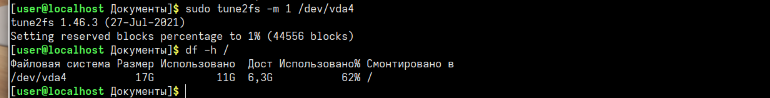

---

### Запись сессии исправления диска

Процесс исправления проблемы с диском я тоже записала через asciinema:

```bash
asciinema rec --idle-time-limit 3 module3_disk_fix.cast
# далее выполнила все шаги диагностики и исправления
exit
asciinema upload module3_disk_fix.cast
```

После загрузки я получила ссылку на запись.

**Ссылка на запись исправления диска:** https://asciinema.org/a/BNyFct0GXqm5SSUm

---

## Вывод

В ходе лабораторной работы я:

1. Освоила работу с **tmux**: научилась делить окно на панели, открывать несколько окон, переключаться между ними и включать синхронизацию ввода для одновременного выполнения команд в нескольких панелях.

2. Научилась пользоваться консольными утилитами мониторинга:
   - `free -h -s` — отслеживание использования оперативной памяти и swap;
   - `vmstat` — просмотр нагрузки на CPU, память, swap и IO;
   - `iostat` — анализ дисковой активности и задержек;
   - `watch df -h` — наблюдение за свободным местом на разделах в реальном времени.

3. На практике увидела, как `stress` влияет на систему: под нагрузкой сразу меняются показатели памяти и CPU, что помогает лучше понимать поведение живой системы.

4. Решила практическую задачу с переполненным диском:
   - нашла крупный файл через `du`;
   - удалила файл и обнаружила, что место освободилось не полностью;
   - с помощью `lsof | grep deleted` нашла процесс, держащий удалённый файл;
   - завершила этот процесс и полностью освободила место на корневом разделе;
   - при необходимости уменьшила резерв файловой системы с помощью `tune2fs`.

В результате я закрепила навыки мониторинга и диагностики, а также научилась безопасно исправлять проблемы с переполнением диска без перезагрузки сервера, что важно для повседневной работы Linux‑администратора.