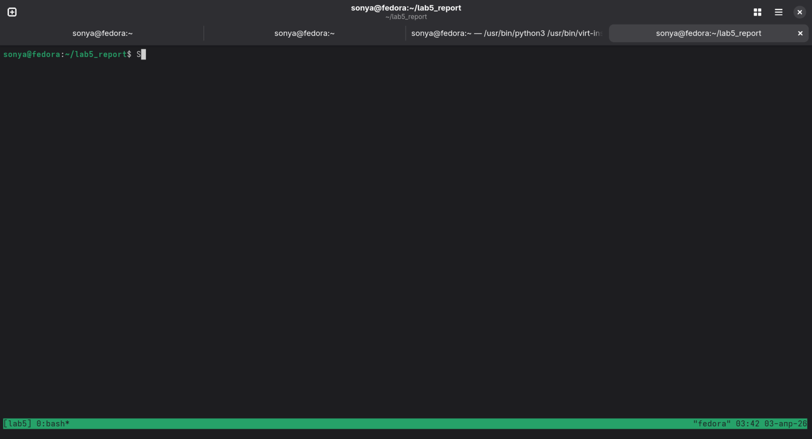
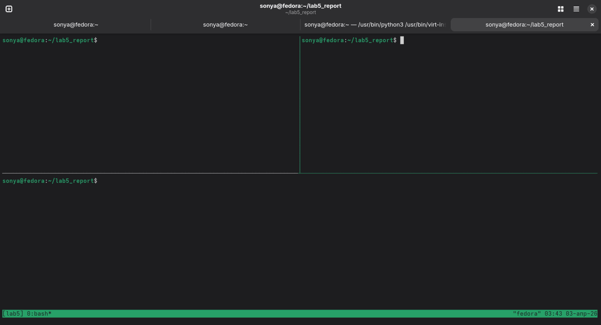
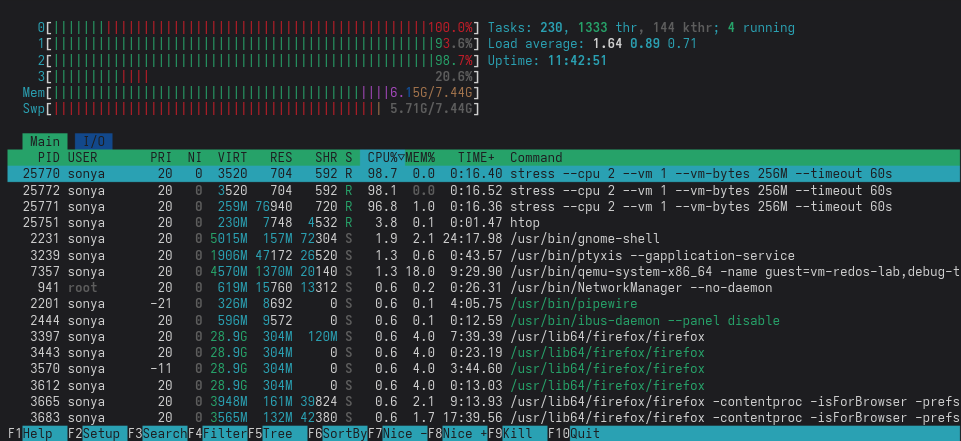
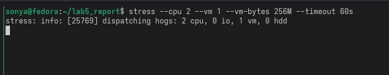
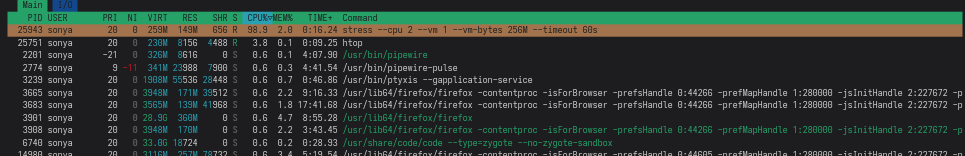
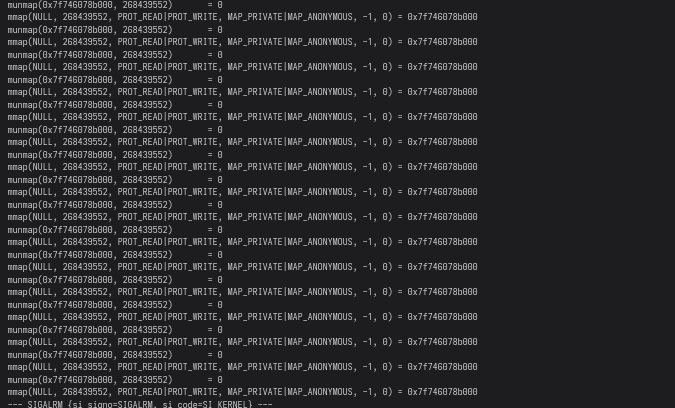
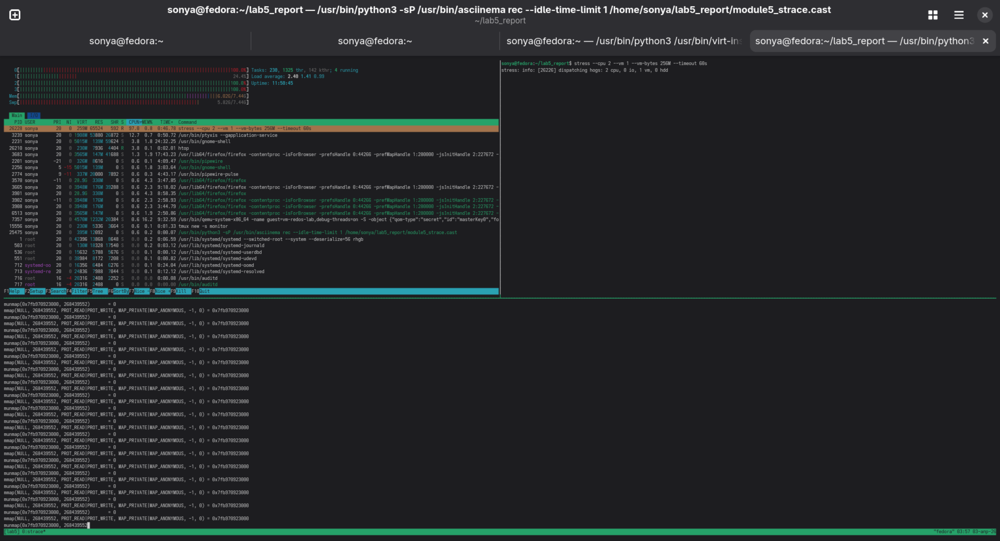
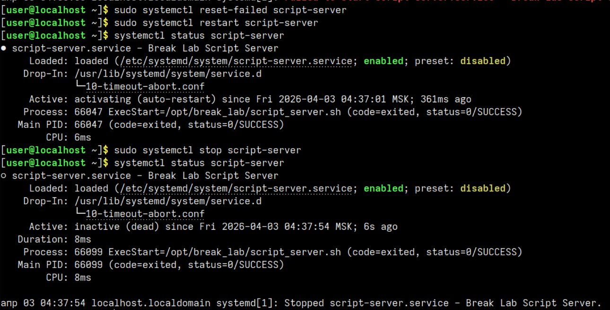

# Лабораторная работа — Модуль 5 и Практика 5

## Цель работы

Научиться использовать `tmux`, `htop`, `stress`, `strace` для мониторинга системы под нагрузкой, а также диагностировать и исправлять падающие systemd‑сервисы через `systemctl` и `journalctl`.

## Краткое описание

Работа состоит из двух независимых частей:

1. **Модуль 5** — запуск трёх панелей в tmux с `htop`, `stress` и `strace`, наблюдение за поведением системы.
2. **Практика 5** — анализ падающего systemd‑сервиса, поиск причины через `journalctl`, исправление и сброс блокировки.

---

## Часть 1 — Модуль 5 (tmux + htop + stress + strace)

### Ход выполнения

#### Установка пакетов

Перед началом я установила необходимые утилиты на Fedora:

```bash
sudo dnf install -y tmux htop stress strace asciinema
```

#### Запуск tmux и создание сессии

```bash
tmux new -s lab5
```



---

#### Создание трёх панелей

Внутри tmux я настроила три панели:

- `Ctrl+b "` — разделила окно на верхнюю и нижнюю панели.
- `Ctrl+b ↑` — перешла в верхнюю панель.
- `Ctrl+b %` — разделила верхнюю панель вертикально.

В результате сверху получилось две панели, снизу — одна.



---

#### Запуск htop

В верхней левой панели я запустила `htop`, чтобы следить за нагрузкой:

```bash
htop
```



---

#### Запуск stress

В верхней правой панели я создала нагрузку командой:

```bash
stress --cpu 2 --vm 1 --vm-bytes 256M --timeout 60s
```



---

#### Поиск PID процесса stress в htop

В `htop` я нажала `F3`, ввела `stress` и нашла процесс в списке:

- строка процесса `stress` подсветилась,
- в первом столбце был виден его PID.



---

#### Запуск strace

В нижней панели я привязала `strace` к найденному PID:

```bash
strace -p 25943
```

В выводе шли системные вызовы (`mmap`, `futex`, `clone` и т.д.), что позволяло видеть «внутреннюю» активность процесса.



---

#### Итоговое наблюдение трёх панелей

Когда `htop`, `stress` и `strace` работали одновременно, я видела:

- в `htop` — рост загрузки CPU примерно до 200 %;
- в правой панели — сам процесс `stress`;
- в нижней панели — системные вызовы, которые он генерирует.



---

[Ссылка на запись модуля 5](https://asciinema.org/a/qRbFjYGtZrssJjX7)

---

## Часть 2 — Практика 5 (systemd)

### Ход выполнения

#### Запуск скрипта‑«ломалки»

Я запустила скрипт, который создаёт падающий systemd‑сервис:

```bash
sudo bash 05_systemd_break.sh
```

Скрипт:

- создал файл `/opt/break_lab/script_server.sh`,
- создал unit `/etc/systemd/system/script-server.service`,
- включил и попытался запустить сервис.


---

#### Диагностика сервиса

Сначала я посмотрела статус:

```bash
systemctl status script-server
```

Статус показывал `failed`, при этом видно, что сервис многократно перезапускался.

Затем я открыла журнал:

```bash
journalctl -u script-server -b --no-pager | tail -30
```

В логах были строки о запуске, выходе с кодом 1 и планируемом перезапуске (restart loop).


---

#### Поиск и исправление причины

Я посмотрела содержимое скрипта:

```bash
cat /opt/break_lab/script_server.sh
```

В конце скрипта стояла строка `exit 1`, из‑за которой он всегда завершался с ошибкой.

Я изменила её на успешный код:

```bash
sudo sed -i 's/exit 1/exit 0/' /opt/break_lab/script_server.sh
cat /opt/break_lab/script_server.sh
```

После этого попыталась перезапустить сервис:

```bash
sudo systemctl restart script-server
systemctl status script-server
```

Сначала systemd выводил `start-limit-hit`, потому что до этого сервис падал слишком часто. Я сбросила счётчик:

```bash
sudo systemctl reset-failed script-server
sudo systemctl restart script-server
systemctl status script-server
```

Теперь основной процесс завершался с кодом 0, но из‑за `Restart=always` сервис продолжал автоматически перезапускаться.


---

#### Остановка сервиса

Для завершения работы я просто остановила сервис:

```bash
sudo systemctl stop script-server
systemctl status script-server
```

Финальный статус стал `inactive (dead)`.



---

[Ссылка на запись практики 5](https://asciinema.org/a/za3FfdTEtrftlP9X)

---

## Итог

Я выполнила обе части лабораторной работы: в первой части научилась удобно наблюдать за процессами под нагрузкой с помощью `tmux`, `htop`, `stress` и `strace`, а во второй — разобралась, как диагностировать и исправлять падающий systemd‑сервис, сбрасывать блокировку `start-limit-hit` и контролировать его состояние через `systemctl` и `journalctl`.